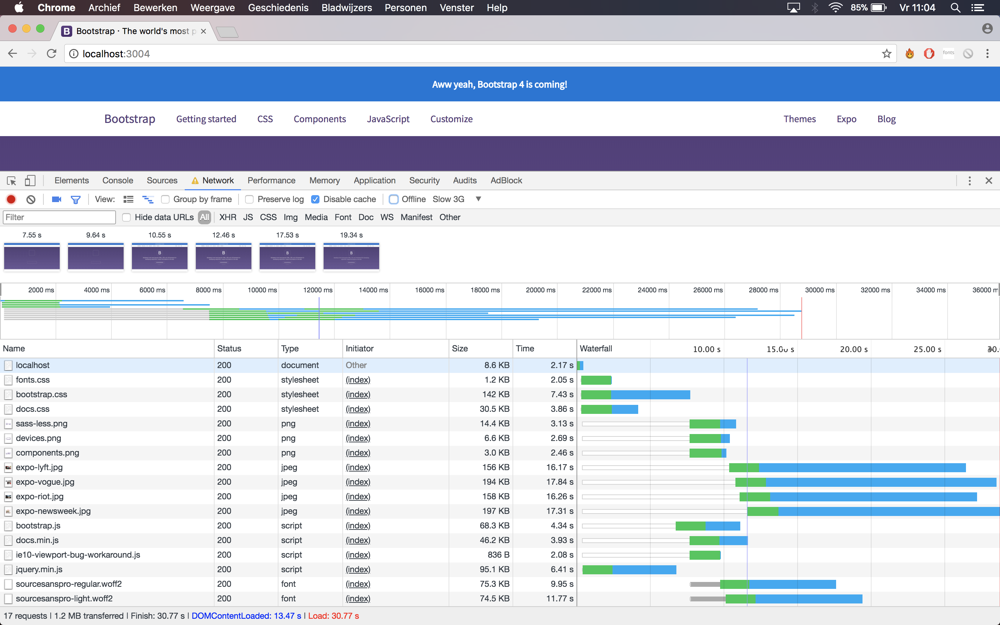

# Performance matters

## Analysis

First paint: 7.55s
DOM content loaded: 13.47s
Finish: 30.77s

- Critical css
  External critical css generator (https://jonassebastianohlsson.com/criticalpathcssgenerator/)

- Font loading
  font-display: swap
  
- Image optimalization
  Image compression, srcset (large 100%, medium 50%, small 30%), sizes

- Async resource loading
  Preload with noscript fallback

## Optimalization

## Screenshots
master
First paint: 7.55s
DOM content loaded: 13.47s
Finish: 30.77s

optimized
First paint: 0.352s
DOM content loaded: 17.08s
Finish: 22.57s

